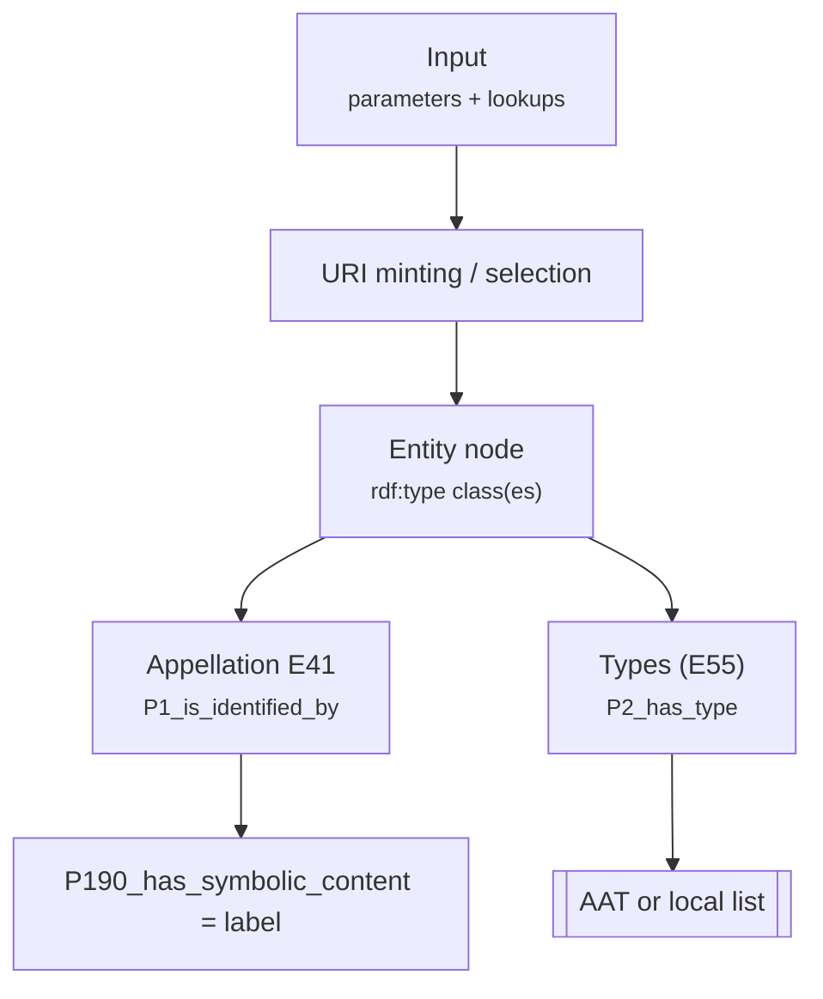

# Function: <functionName>

> **Purpose (one-liner):** <what this function does in plain English>.
> 
> **When to use:** <situations where this is the right helper>.

> Common inputs: `g` (Graph), `uri` (UriFactory), `u` (UUIDManager) — see [Common parameters](common-parameters.md).  
> **Parameter order:** `g, uri, u, …, aatIndex, …` (edit as needed for this function).

---

## Parameters

> Tip: wrap types in backticks. For optional types, use a **word‑joiner** to prevent wrapping, e.g. `` `?&#8288;string` ``.

| Name | Type | Req | Meaning | Notes |
|---|---|:--:|---|---|
| g, uri, u |  | ✓ | Common first 3 parameters | See [Common parameters](common-parameters.md). |
| <paramName> | `string` | ✓ | <meaning> | <notes> |
| <optionalParam> | `?&#8288;string` |  | <meaning> | <notes> |
| aatIndex | `?array` |  | Common lookup (AAT index) | See [Common parameters](common-parameters.md). **Position:** nᵗʰ argument. |

## Returns
- <describe the return type and meaning>

---

## Example input

> Keep this short and realistic. Include any lookups or indexes used.

**PHP call**
```php
<php snippet invoking the function>
```

**Auxiliary data (e.g., AAT index JSON)**
```json
{
  "oil_paint": {"id": "aat:300015050", "label": "oil paint"}
}
```

---

## Expected output (RDF/Turtle excerpt)

```turtle
<#...> a crm:E.. ;
  rdfs:label "..." .
```

> Include only the triples asserted by this function (and direct sub-helpers it calls).

---

## Visual: how input becomes CRM triples



---

## Behaviour & edge cases

- <idempotency, defaults, when it falls back, etc.>
- <normalisation rules, required prefixes, validation>

---

## Related

- See also: <links to other function docs>
- Conventions: [/docs/conventions.md](../conventions.md)

---

<details>
<summary><h2>PHP Code</h2></summary>

```php
function FUNCTIONNAME
// actual full php code of the function
```
</details>

---

## Changelog

| Date | Change |
|------|--------|
| YYYY-MM-DD | Initial doc created |
