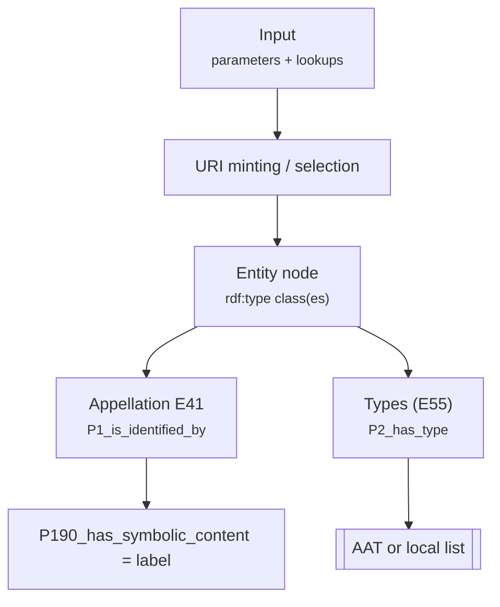

# Function: <functionName>

> **Purpose (one-liner):** <what this function does in plain English>.  
> **When to use:** <situations where this is the right helper>.

---

## Signature

```php
function <functionName>(<typed parameters>): <return type>
```

## Parameters

| Name | Type | Required | Meaning | Notes |
|---|---|:--:|---|---|
|  |  |  |  |  |

## Returns
- <describe the return type and meaning>

---

## Example input

> Keep this short and realistic. Include any lookups or indexes used.

**PHP call**
```php
<php snippet invoking the function>
```

**Auxiliary data (e.g., AAT index JSON)**
```json
{
  "oil_paint": {"id": "aat:300015050", "label": "oil paint"}
}
```

---

## Expected output (RDF/Turtle excerpt)

```turtle
<#...> a crm:E.. ;
  rdfs:label "..." .
```

> Include only the triples asserted by this function (and direct sub-helpers it calls).

---

## Visual: how input becomes CRM triples



> Replace nodes with the exact resources/relations your function asserts.

---

## Behaviour & edge cases

- <idempotency, defaults, when it falls back, etc.>
- <normalisation rules, required prefixes, validation>

---

## Related

- See also: <links to other function docs>
- Conventions: [/docs/conventions.md](../conventions.md)

---

## Changelog

| Date | Change |
|------|--------|
| YYYY-MM-DD | Initial doc created |
