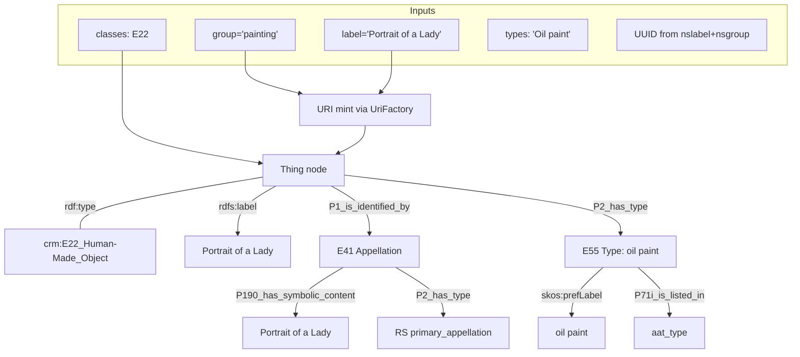

# Function: easyRDFAddThing

> **Purpose:** Create a new CIDOC CRM entity with a human-readable label and (by default) an **E41 Appellation** carrying the label as `crm:P190_has_symbolic_content`.

> **When to use:** Whenever you need a stable, mintable URI and primary appellation for a resource (e.g., painting, sample, person, type).

---

## Parameters

Common inputs: g (Graph), uri (UriFactory), u (UUIDManager) — [Common parameters](common-parameters.md)

| Name | Type | Req | Meaning | Notes |
|---|---|:--:|---|---|
| g, uri, u |  | ✓ | Common first 3 parameters | see [Common parameters](common-parameters.md) |
| group | string | ✓ | Logical group / path segment | e.g., `painting`, `sample` |
| classes | array | ✓ | CRM classes to assert | e.g., `['crm:E22_Human-Made_Object']` |
| types | array |  | Types to attach to the thing | **Shape:** `label => [tags]`, passed to `easyRDFAddTypes` |
| label | string | ✓ | Human-readable text | Also used to seed UUID if `nslabel` null |
| nslabel | ?&#8288;string |  | UUID name | Defaults to `label` |
| nsgroup | ?string |  | UUID namespace | Defaults to `group` |
| aatIndex | ?array |  | Common lookup | see [Common parameters](common-parameters.md). |
| isSymbolicObject | ?string |  | If truthy, write P190 on the thing and **skip E41** | Use sparingly |
| isPartOfUri | ?string |  | Override parent URI | Final URI: `{isPartOfUri}/{group}` |


## Returns
- **string** — the minted entity URI in the form:
```
https://data.example.org/resource/GROUP/c17e0f01-01da-4eb4-9a35-0bbf314b1848
```

---

## Example input

**PHP call**
```php
$g = new Graph();
$g->setNamespace('crm', 'http://www.cidoc-crm.org/cidoc-crm/');
$g->setNamespace('rdfs', 'http://www.w3.org/2000/01/rdf-schema#');
$g->setNamespace('skos', 'http://www.w3.org/2004/02/skos/core#');
$g->setNamespace('aat', 'http://vocab.getty.edu/aat/');

$uri  = new UriFactory('https://data.example.org');
$uuid = new UUIDManager();

$aatIndex = [
  "oil_paint" : {"id":"aat:300015050","label":"oil paint"}
];

$thingUri = easyRDFAddThing(
  $g, $uri, $uuid,
  'painting',
  ['crm:E22_Human-Made_Object'],
  ['Oil paint' => []],   // passed through to easyRDFAddTypes
  'Portrait of a Lady'
);
```

---

## Expected output (RDF/Turtle excerpt)

```turtle
<https://data.example.org/painting/UUID> a crm:E22_Human-Made_Object ;
  rdfs:label "Portrait of a Lady" ;
  crm:P1_is_identified_by <https://data.example.org/painting/UUID/primary_appellation> ;
  crm:P2_has_type <http://vocab.getty.edu/aat/300015050> .

<https://data.example.org/painting/UUID/primary_appellation>
  a crm:E41_Appellation ;
  crm:P2_has_type <http://www.researchspace.org/resource/system/vocab/resource_type/primary_appellation> ;
  crm:P190_has_symbolic_content "Portrait of a Lady" .

<http://vocab.getty.edu/aat/300015050>
  a crm:E55_Type ;
  rdfs:label "oil paint" ;
  crm:P190_has_symbolic_content "oil paint" ;
  skos:prefLabel "oil paint" ;
  crm:P71i_is_listed_in <http://www.researchspace.org/resource/vocab/aat_type> .
```

---

## Visual: how input becomes CRM triples



---

## Behaviour & edge cases

- **Idempotent URIs** when `(nslabel, nsgroup)` don’t change; if labels are volatile, consider `isPartOfUri`.
- **Symbolic objects:** setting `isSymbolicObject` skips E41 and writes `P190` on the main node — only for truly textual resources.
- Requires prefixes `crm`, `rdfs` (and `skos`, `aat` if you pass types).

---

## Related

- [`easyRDFAddTypes`](./easyRDFAddTypes.md)
- Conventions: [/docs/conventions.md](../conventions.md)

---
<details>
<summary><h2>PHP Code</h2></summary>
  
```php

// Version 1.0
function easyRDFAddThing (
  Graph $g,
  UriFactory $uri,
  UUIDManager $u,
  string $group,
  array $classes,
  array $types,    
  string $label,    
  ?string $nslabel = null,    
  ?string $nsgroup = null,
  ?array $aatIndex = [],
  ?string $isSymbolicObject = null,
  ?string $isPartOfUri = null
): string {
  
  if (!$nslabel) {$nslabel = $label;}
  if (!$nsgroup) {$nsgroup = $group;}
  
  if ($isPartOfUri)
    {$thingUri = $isPartOfUri."/".$group;}
  else
    {$thingUri = $uri->mint($group, $u->get($nslabel, $nsgroup));}
    
  $g->addLiteral ($thingUri, 'rdfs:label', trim($label));
  
  if ($isSymbolicObject)
    {
    $g->addLiteral ($thingUri, 'crm:P190_has_symbolic_content', trim($label)); 
    }
  else
    {
    $thingAppUri = $thingUri."/primary_appellation";

    $g->addResource ($thingAppUri, 'rdf:type', 'crm:E41_Appellation'); 
    $g->addResource ($thingAppUri, 'crm:P2_has_type', 'http://www.researchspace.org/resource/system/vocab/resource_type/primary_appellation');
    $g->addLiteral ($thingAppUri, 'crm:P190_has_symbolic_content', trim($label)); 
    $g->addResource ($thingUri, 'crm:P1_is_identified_by', $thingAppUri);
    }
  
  foreach ($classes as $k => $c)
    {$g->addResource($thingUri, 'rdf:type', $c);}    
  
  if ($types)
    {easyRDFAddTypes($g, $uri, $u, $types, $thingUri, $aatIndex);}
  
  return $thingUri;
  }
```

</details>

## Changelog

| Date       | Change |
|------------|--------|
| 2025-10-08 | Initial function doc created |
