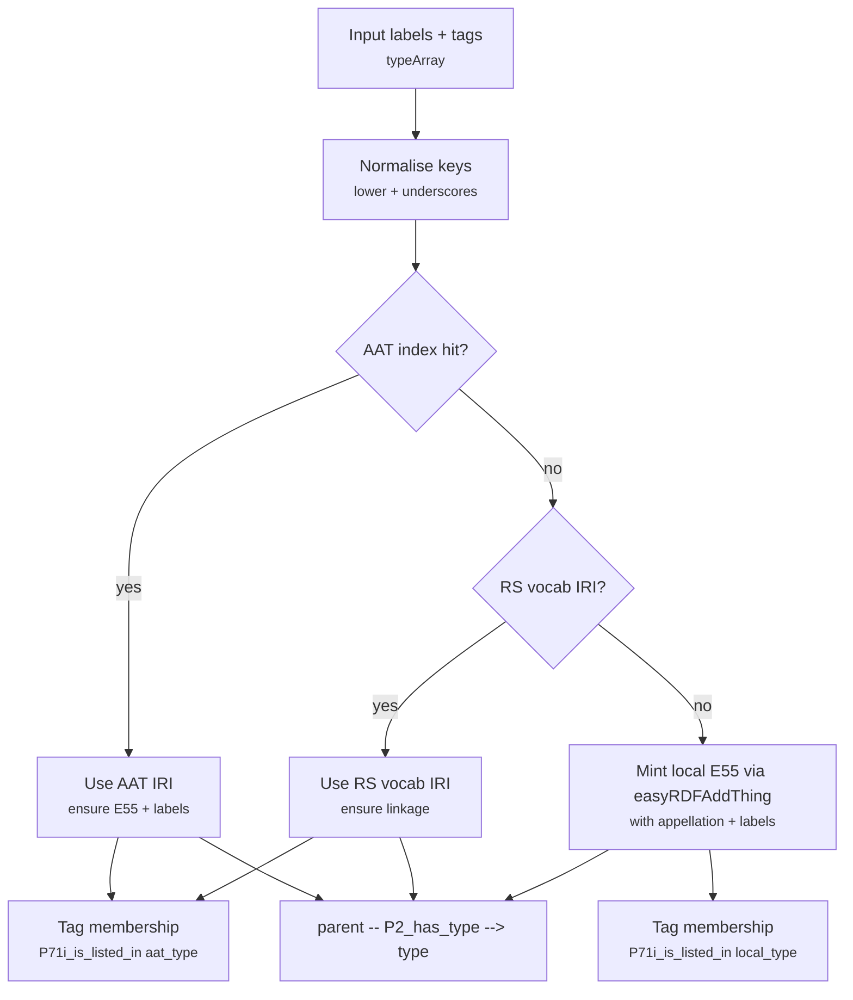

# Function: easyRDFAddTypes

> **Purpose (one-liner):** **Resolve _or construct_ type nodes and assert the triples needed for them to exist as `crm:E55_Type` (labels, prefLabels, list membership), then attach them to a parent resource.** In short: *make sure the type exists + link it*.
> 
> **When to use:** When you have human-readable type labels (or AAT/RS identifiers) and need guaranteed, well-formed `crm:E55_Type` nodes in your graph — and an asserted link from a parent entity via `crm:P2_has_type` (or another predicate).

---

## Parameters

Common inputs: g (Graph), uri (UriFactory), u (UUIDManager) — [Common parameters](common-parameters.md)

| Name | Type | Req | Meaning | Notes |
|---|---|:--:|---|---|
| g, uri, u |  | ✓ | Common first 3 parameters | see [Common parameters](common-parameters.md) |
| typeArray | array | ✓ | Map of type labels to membership tags | **Shape:** `label => [tags]` e.g., `['Oil paint' => ['materials']]` |
| parentUri | ?&#8288;string |  | Resource to link from | If present, asserts `parentUri --typePred--> typeUri` |
| aatIndex | array |  | AAT lookup (normalised keys) | see [Common parameters](common-parameters.md). **Position:** 6th argument |
| typePred | ?string |  | Predicate used to link types | Default: `crm:P2_has_type` |
| typeClass | ?string |  | Class for type nodes | Default: `crm:E55_Type` |

## Returns
- **`array`** — mapping **(final label)** ⇒ **type URI** used/created.

---

## Example input

**PHP call**
```php
$g = new Graph();
$g->setNamespace('crm', 'http://www.cidoc-crm.org/cidoc-crm/');
$g->setNamespace('rdfs', 'http://www.w3.org/2000/01/rdf-schema#');
$g->setNamespace('skos', 'http://www.w3.org/2004/02/skos/core#');
$g->setNamespace('aat', 'http://vocab.getty.edu/aat/');

$uri  = new UriFactory('https://data.example.org');
$uuid = new UUIDManager();

$aatIndex = [
  'oil_paint' => ['id' => 'aat:300015050', 'label' => 'oil paint']
];

$typeUris = easyRDFAddTypes(
  $g, $uri, $uuid,
  [
    'Oil paint'       => ['materials'],
    'Local term only' => ['materials']
  ],
  'https://data.example.org/painting/abc', // parent
  $aatIndex
);
```

**Auxiliary data (e.g., AAT index JSON)**
```json
{
  "oil_paint": { "id": "aat:300015050", "label": "oil paint" }
}
```

---

## Expected output (RDF/Turtle excerpt)

```turtle
# Parent linked to both the resolved AAT type and a new local type
<https://data.example.org/painting/abc>
  crm:P2_has_type <http://vocab.getty.edu/aat/300015050> ,
                   <https://data.example.org/type/UUID2> .

# AAT-resolved type (ensured to exist with the right classing & labels)
<http://vocab.getty.edu/aat/300015050>
  a crm:E55_Type ;
  rdfs:label "oil paint" ;
  crm:P190_has_symbolic_content "oil paint" ;
  skos:prefLabel "oil paint" ;
  crm:P71i_is_listed_in <http://www.researchspace.org/resource/vocab/aat_type> .

# Locally minted E55 Type (constructed if no AAT/RS match)
<https://data.example.org/type/UUID2>
  a crm:E55_Type ;
  rdfs:label "Local term only" ;
  crm:P190_has_symbolic_content "Local term only" ;
  skos:prefLabel "Local term only" ;
  crm:P71i_is_listed_in <http://www.researchspace.org/resource/vocab/local_type> .
```

> Only the triples asserted directly by this function (and its direct sub-helper `easyRDFAddThing` for local types) are shown.

---

## Visual: how input becomes CRM triples



---

## Guarantees

- For each input label:
  - **AAT match:** the AAT node is asserted as `crm:E55_Type` and labelled (`rdfs:label`, `crm:P190_has_symbolic_content`, `skos:prefLabel`).
  - **RS vocab IRI:** the supplied IRI is used directly (no duplicate local nodes).
  - **Local fallback:** a new `crm:E55_Type` is minted with an E41 appellation (via `easyRDFAddThing`) and labelled.
- **Membership tagging:** each type is tagged with `crm:P71i_is_listed_in` → `.../aat_type` or `.../local_type` + any user-supplied tags.
- **Linkage:** if `parentUri` is provided, the edge `parentUri -- typePred --> typeUri` is asserted.
- **Idempotence:** identical inputs converge to the same URIs and triples (given deterministic UUID settings).

---

## Behaviour & edge cases

- **Key normalisation:** label → lowercased and spaces collapsed to underscores (e.g., “Inventory Number” → `inventory_number`) for AAT lookup.
- **AAT resolution:** accepts CURIEs (e.g., `aat:300015050`) or full IRIs; expands via `expandCurieOrIri()`.
- **ResearchSpace built-ins:** if the provided label matches `https?://www.researchspace.org/resource/vocab/.../...`, use it directly.
- **Local fallback:** if no AAT or RS IRI, mint a local `crm:E55_Type` (with appellation via `easyRDFAddThing`) and set `skos:prefLabel`.
- **Custom predicates & classes:** override `typePred` and `typeClass` as needed (e.g., `crm:P137_exemplifies`).

---

## Related

- See also: [`easyRDFAddThing`](./easyRDFAddThing.md)
- Conventions: [/docs/conventions.md](../conventions.md)

---

<details>
<summary><h2>PHP Code</h2></summary>

```php
function easyRDFAddTypes(
    Graph $g,
    UriFactory $uri,
    UUIDManager $u,
    array $typeArray,
    ?string $parentUri = null,
    array $aatIndex = [],
    ?string $typePred = "crm:P2_has_type",
    ?string $typeClass = "crm:E55_Type"
): array {
  
  $typeUris = [];
  
  foreach ($typeArray as $label => $typeTypes)
    {
    
    // normalise key to match your index style (e.g., "Inventory Number" -> "inventory_number")
    $key = strtolower(trim(preg_replace('/\s+/', '_', $label)));
      
    // Resolve AAT concept if present
    if (isset($aatIndex[$key]['id'])) {
      $curie  = $aatIndex[$key]['id']; // e.g., 'aat:300312355' or a full IRI
      $label  = $aatIndex[$key]['label'] ?? $label;
      $typeUri = expandCurieOrIri($curie, $g); // expand 'aat:...' using graph prefixes

      // Treat the AAT concept as the E55 Type unless defined as something else.       
      $g->addResource($typeUri, 'rdf:type', $typeClass);
        $g->addLiteral ($typeUri, 'rdfs:label', $label);
        $g->addLiteral ($typeUri, 'crm:P190_has_symbolic_content', "$label"); 
        $g->addLiteral ($typeUri, 'skos:prefLabel', $label);
      
      $typeTypes[] = "aat_type";
      }
    else if (preg_match('#^https?://www\.researchspace\.org/resource/vocab/[^/]+/[^/]+$#', $label)) {
      $typeUri = $label; //Supplied an existing RS type - No need to add it to a list.
      }  
    else {
      $typeUri = easyRDFAddThing ($g, $uri, $u, "type",
        [$typeClass], [], $label, null, null, 
        $aatIndex);     
        $g->addLiteral ($typeUri, 'skos:prefLabel', $label);
    
      $typeTypes[] = "local_type";        
      }
  
  // This may need to be updated or changed for more general use and or 
  // externally defined controlled lists.
  foreach ($typeTypes as $k => $typeType)
    {$g->addResource ($typeUri, 'crm:P71i_is_listed_in', "http://www.researchspace.org/resource/vocab/".$typeType.""); }

  // Link parent -> type (as a RESOURCE, not a literal)
  if ($parentUri) {
    $g->addResource($parentUri, $typePred, $typeUri);} 
    
  $typeUris[$label] = $typeUri;
  }  

  return $typeUris;
  }
```
</details>

---

## Changelog

| Date       | Change |
|------------|--------|
| 2025-10-08 | Clarified purpose to include type creation + attachment guarantees. |
